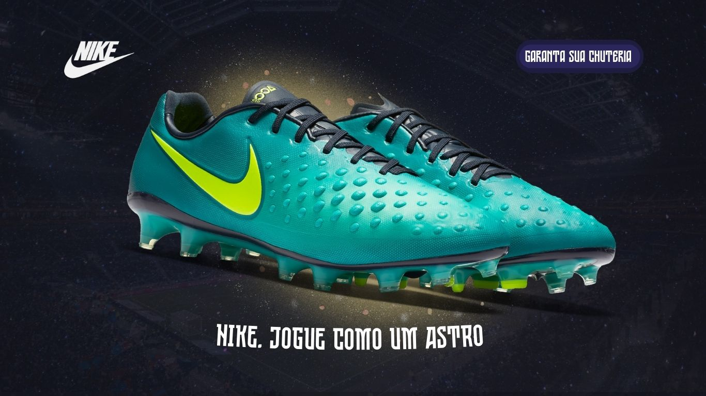

# Projeto Publicitário Nike 

MENU:   
> 1. [Objetivo](#objetivo-do-projeto)  
> 2. [Linguagens](#linguagens-usadas)  
> 3. [Serventia](#para-que-serve)
> 4. [Usabilidade](#usabilidade)

##  Objetivo do projeto 
O princípal objetivo para eu ter desenvolvido esse trabalho foi para praticar e fixar oque aprendi enquanto iniciava meus estudos de HTML e CSS.

Descidi por criar uma landing page mais simples pois assim ficaria mais claro e simples para melhorar ainda mais o meu aprendizado.

##  Linguagens usadas 
As linguagens usadas foram:
* HTML
* CSS

##  Para que serve 
Essa Landing Page teria por intuito divulgar as chuteiras nike. Seria uma página usada para chamar a atenção das pessoas e redirecionar para o site oficial nike

##  Usabilidade 
Essa página para ter um melhor resultado, poderia ser empregada em alguma outra página dentro de um outro web site.  

No entanto como o objetivo do trabalho é apenas para a prática das linguagens preferi não focar muito em sua usabilidade

---

### ( Esse projeto tem por fim apenas motivos de estudos )
